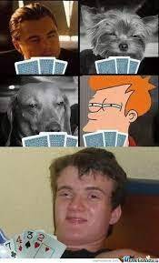

# Grundlagen Woche 2, Tag 5: Kartenspiel

  

#### Hinweise zur Bearbeitung:

- Achte auf einen sauberen Quellcode, insbesondere Einrückungen sind wichtig!
- Bevor ihr zur nächsten Aufgabe weiter geht, testet euren Code! Er sollte nicht nur kompilieren und ausführen, sondern
  auch das richtige, gewünschte Ergebnis ergeben.
- Bitte pushe am Ende des Tages unbedingt den aktuellen Stand deines Projekts auf Github.

#### Beschreibung:

Willkommen zurück zu der zweiten Praxisaufgabe! In der heutigen Aufgabe werden wir ein kleines Kartenspiel
programmieren! Ihr wollt euch mit einer/einem eurer Freund/innen zum Kartenspielen treffen.
Nachdem Ihr euch getroffen habt, fällt euch auf, dass niemand ein Kartendeck mitgebracht hat. Da fällt Dir ein, dass
Du theoretisch ein Kartenspiel auch digital programmieren kannst. Du entscheidest dich, der Idee einen
Versuch zu geben und startest IntelliJ.

Datei für alle Aufgaben: *Main.kt*

---

 <b> Aufgabe 1 - Kartenstapel mischen</b> 

Wir wollen heute ein Kartenspiel simulieren, dafür hast du bereits eine Liste mit Karten *kartenDeck* gegeben. Kopiere
diese Liste und konvertiere sie zu einer Liste, die wir auch verändern können. Diese veränderbare Liste nennen wir ab
jetzt *Kartenstapel*. Am Anfang eines Spiels sollte der Kartenstapel immer einmal gemischt werden. Mische also die
veränderbare Liste und gib sie in der Konsole aus!

---

 <b> Aufgabe 2 - Eine Karte ziehen </b> 

Nachdem du die Karten gemischt hast, wollen wir mit der ersten Karte beginnen, die auf den Tisch gelegt wird. Ziehe also
die oberste (erste) Karte aus dem Stapel und gib diese auf der Konsole aus. Vergiss nicht diese Karte auch anschließend
aus dem Kartenstapel zu entfernen damit sie später nicht nochmal gezogen werden kann!

---

 <b> Aufgabe 3 - Wert einer Karte ermitteln </b> 

Die Karte liegt nun auf dem Tisch, jetzt wollen wir wissen wie viele Punkte sie wert ist. Nutze die gegebene Map
*karteZuWert*, um den Wert der gezogenen Karte herauszufinden und gib den Wert dieser Karte in der Konsole aus!

---

 <b> Aufgabe 4 - Karten für die Spieler ziehen </b> 

Wir nehmen an, dass zwei Spieler/innen an unserem Spiel teilnehmen werden. Die Spieler/innen sollen nun abwechselnd
Karten ziehen
bis jede/r drei Karten auf der Hand hat. Erstelle hierfür für jede/n Spieler/in eine eigene Liste. Ziehe anschließend
abwechselnd jeweils eine Karte aus dem Kartenstapel und füg sie einer Hand eines/einer Spielers/Spielerin hinzu. Vergiss
nicht jedes Mal
nach dem Ziehen die gezogene Karte aus dem Stapel zu entfernen, damit keine Karte doppelt gezogen werden kann!

---

 <b> Aufgabe 5 - Den Wert der Hände herausfinden </b> 

Finde mithilfe der gegebenen Map heraus, wie viele Punkte die Hände der beiden Spieler/innen nun wert sind und gib die
Ergebnisse in der Konsole aus.

---

 <b> Aufgabe 6 - Die Karte mit dem niedrigsten Wert abwerfen </b> 

Finde für jeden der beiden Spieler/innen die Karte mit dem niedrigsten Wert auf der jeweiligen Hand. Lass beide
Spieler/innen diese Karte
abwerfen und eine neue Karte ziehen. Finde anschließend erneut den Wert der beiden Hände heraus und gib diesen für beide
Spieler/innen aus! (vgl.
Aufgabe 5)

---

 <b> Aufgabe 7 - Fertiges Spiel implementieren </b> 

Hier wollen wir nochmal alle Schritt die wir oben schon einzeln ausgeführt haben noch einmal benutzen und einen
Spiel-Ablauf simulieren.

<ol type="1">
  <li>Gib zunächst folgende Zeichenkette "----------------------------------" aus.</li>
  <li>Lass die beiden Spieler/innen ihre Namen angeben und speichere diese ab</li>
  <li>Erstelle und mische einen *komplett neuen* Kartenstapel</li>
  <li>Ziehe die oberste Karte, finde ihren Wert heraus und gib diesen aus</li>
  <li>Lass die beiden Spieler jeweils eine Hand von 3 Karten ziehen</li>
  <li>Jede/r Spieler/in wirft nun die Karte mit dem niedrigsten Wert ab und zieht eine neue</li>
  <li>Errechne für jede Hand der Spieler/innen den Wert der Karten und gib diese aus</li>
</ol> 

---

 <b> Bonus - Die Spieler/innen selbst entscheiden lassen </b> 

Evtl. verändern sich irgendwann die Spielregeln unseres Spiels und es ist nicht mehr passend immer die Karte mit dem
kleinsten Wert von der Hand abzuwerfen. Verändere das Programm so, dass die Spieler/innen zukünftig gefragt werden
welche Karte von der Hand abgeworfen und ersetzt werden soll!

---
